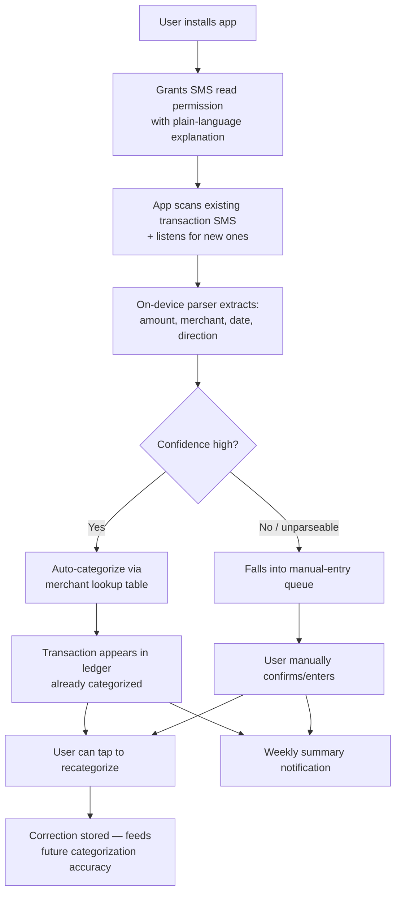
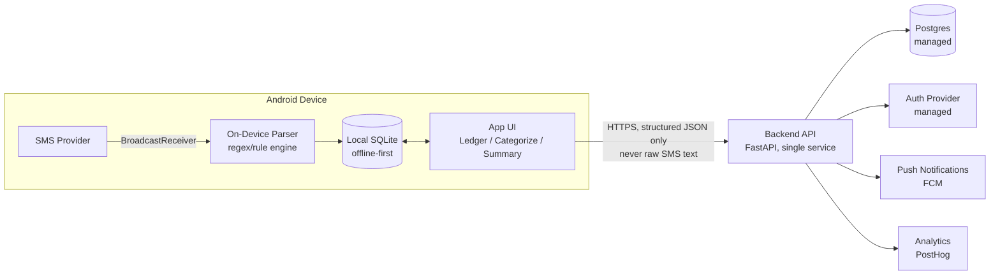

# Pilot System Design & Architecture — Expense Capture Wedge

## What This Document Is (and Isn't)

Every document in `docs/phase-1-foundation/` through `docs/phase-9-engineering-operations/` is a **requirements specification** — a description of what a future document should contain, written for a company that has already validated it should exist at 100M-user scale. This document is different: it is the **actual, concrete architecture for the thing we build next** — a pilot to test with ~20–30 real users, before any of that scale is earned.

Nothing here should look like Phase 4's Technical Architecture. There is no Kubernetes, no event bus, no multi-region deployment, no microservices. Every decision below is optimized for **one question**: can we get a working expense-capture loop in front of real users in the shortest possible time, and learn whether the core hypothesis (automatic capture removes enough friction that people actually use it) holds?

If it holds, this document becomes Step 1 of the path toward Phase 4/5's architecture — not a discarded prototype. Where relevant, each section notes what it maps to later.

---

## 1. Pilot Scope

**In scope:**
- Android app that listens for transaction SMS (bank debit/credit alerts, UPI payment confirmations) and parses them into structured transactions automatically, with zero manual entry required for the common case.
- A simple ledger view: list of transactions, category, amount, date, merchant.
- One-tap re-categorization when the automatic guess is wrong (this correction data is the seed for everything Phase 5 eventually builds).
- A weekly summary notification ("You spent ₹X this week, up/down from last week").
- Manual transaction entry as a fallback (covers cash spend and the rare unparseable SMS).

**Explicitly out of scope for the pilot** (deferred to later, once the core loop is validated):
- iOS. Not "later this quarter" — genuinely blocked until we decide on an alternative capture mechanism for iOS (email receipt parsing, manual entry, or bank-statement import), because SMS reading isn't available there at all.
- Budgets, spend prediction, bills, subscriptions — everything in Phase 3's Finance Suite beyond Expense Capture itself.
- Any other pillar (Productivity, Health). This pilot tests one wedge, not the unified assistant.
- ML-based parsing. Bank/UPI SMS formats are regular enough for rule-based parsing to work for the pilot; ML parsing (Phase 5 Doc 19) is a later optimization once we have real failure-rate data to justify it.
- Banking API / account-aggregator integration (Phase 4 Doc 48). SMS-based capture only.
- Multi-user / family sharing, premium tiers, notifications arbitration across pillars — none of it applies to a single-pillar, single-user pilot.
- Any backend sophistication beyond "one API, one database." No event architecture, no service decomposition, no multi-region.

## 2. User Flow (What the Pilot Actually Does)



## 3. High-Level Architecture



Two things worth calling out because they're deliberate, not accidental:

- **Parsing happens on-device, not on the backend.** The raw SMS text never leaves the phone. Only the structured result (amount, merchant, date, direction, category) is synced. This is the one piece of Phase 5/6's data-minimization philosophy (Doc 30, Doc 13) that costs nothing to do correctly from day one and is very expensive to retrofit later — so it's in the pilot even though almost everything else from those phases is deferred.
- **The app is offline-first.** SMS parsing and the ledger view work with zero network connectivity; sync to the backend happens opportunistically. This matters because the core value (never miss a transaction) shouldn't depend on connectivity.

## 4. Component Breakdown

| Component | Responsibility | Why this is enough for the pilot |
|---|---|---|
| Android App | SMS listening, on-device parsing, local ledger, UI | All the actual product value lives here; the backend exists mainly for sync/backup and cross-session summary generation |
| On-Device Parser | Regex/rule-based extraction of amount/merchant/date/direction from SMS text | Bank and UPI SMS formats are drawn from a small, fairly stable set of templates per bank/PSP — a rule engine gets you very far before ML is worth the complexity |
| Backend API | Auth, sync transactions, serve ledger/summary, store corrections | One service, one responsibility: durable storage + cross-device sync. Not a "Finance Service" in the Phase 4 sense — that's the eventual destination, not the starting point |
| Postgres | Transactions, categories, merchant rules, corrections | Relational fits this data naturally; no need for the Phase 4 Storage/Databases document's multi-store reasoning at this scale |
| Auth Provider (managed) | Phone/email login | Don't build this yourself at pilot stage — use a managed provider (Firebase Auth or Supabase Auth) |
| Push (FCM) | Weekly summary notification | The entire Phase 2 Notification System's arbitration logic doesn't apply when there's exactly one notification type |
| Analytics (PostHog or similar) | Instrument the validation metrics (Section 9) | This is arguably more important than any other component — it's how we find out if the hypothesis holds |

## 5. Platform Decision: Android-Only Pilot

**Decision:** build Android-only (native, Kotlin) for the pilot.

**Why:** the entire pilot hypothesis is "automatic capture removes enough friction that people actually use this daily." SMS-based auto-capture is only possible on Android — iOS has no public API for reading SMS content (only a narrow autofill mechanism for one-time codes, not general message content). Building cross-platform (React Native, Flutter) buys nothing here since the core capability is a native-only permission anyway, and native Kotlin gives the most reliable, best-documented access to `SmsManager`/`BroadcastReceiver` APIs.

**This is a judgment call you should confirm, not a fact:** if you already have iOS-leaning users in mind for the pilot cohort, this decision excludes them from the automatic-capture experience entirely (they'd only get manual entry, which doesn't test the actual hypothesis). Worth deciding explicitly before recruiting pilot users.

## 6. SMS Parsing Design

- A `BroadcastReceiver` listens for incoming SMS matching a sender-ID allowlist pattern (bank/PSP short codes) and scans SMS history on first install for the same.
- Parsing is a layered rule engine: (1) sender-ID match → (2) template match against a maintained library of per-bank/per-PSP SMS formats → (3) regex extraction of amount, merchant/counterparty, date, debit-vs-credit direction → (4) confidence score based on which layer matched.
- Low-confidence or non-matching messages fall into the manual-entry queue rather than being silently dropped or guessed — this preserves trust (an unexplained missing transaction is worse than an explicit "couldn't parse this one, please confirm").
- The per-bank template library starts small (cover whichever 3–5 banks/UPI apps your pilot cohort actually uses) and grows based on real failure data — don't try to pre-build broad coverage before you know who's testing it.

## 7. Data Model

```
users
  id, phone_or_email, created_at

transactions
  id, user_id, amount, direction (debit/credit), merchant_raw, merchant_normalized,
  category_id, date, source (sms_auto | manual), confidence_score,
  is_user_corrected, created_at

categories
  id, name, is_system_default (seed with ~12-15 common categories)

merchant_rules
  id, merchant_pattern, category_id, created_from (system | user_correction)

corrections
  id, transaction_id, old_category_id, new_category_id, corrected_at
  -- this table is the entire seed dataset for Phase 5's future categorization ML
```

## 8. API Design (Core Endpoints)

```
POST   /auth/request-otp
POST   /auth/verify-otp

POST   /transactions/sync        -- batch upload of on-device-parsed transactions
GET    /transactions              -- paginated ledger
PATCH  /transactions/{id}/category -- user correction (writes to corrections table)

GET    /summary/weekly            -- powers the weekly notification content

POST   /transactions/manual       -- manual entry fallback
```

No GraphQL, no versioning scheme, no API gateway (Phase 4 Docs 05–06) — a handful of REST endpoints behind the managed auth provider is the entire API surface this pilot needs.

## 9. Security & Privacy Minimums (Not Skippable, Even at Pilot Scale)

This is financial data. "It's just a pilot" is not a reason to cut these corners:

- HTTPS everywhere; no plaintext transport, ever.
- Raw SMS text never transmitted or stored server-side — only structured, parsed fields.
- Encryption at rest via the managed Postgres provider's defaults (this alone covers the realistic pilot-stage threat model; field-level/HSM-based key management from Phase 6 Doc 10 is not warranted yet).
- Explicit, plain-language consent screen before requesting SMS permission, stating exactly what is and isn't read/transmitted (a minimal, honest version of Phase 3's Permissions & Consent PRD).
- A working "delete my account and data" action from day one — trivial to build now, painful to retrofit, and the right thing to do with people's financial data regardless of company stage.
- No third-party data sharing of any kind at pilot stage — not even "aggregated/anonymized" analytics vendors touching raw transaction data. Structured, non-identifying product-usage events only.

## 10. Tech Stack (Concrete Recommendation)

| Layer | Choice | Rationale |
|---|---|---|
| Mobile | Kotlin, native Android | Direct, reliable access to SMS APIs; no cross-platform framework buys anything here |
| Backend | Python, FastAPI | Fast to build, and the same language ecosystem Phase 5's future ML parsing work will eventually live in |
| Database | Postgres (managed — Neon or Supabase) | Relational fit is natural; managed = zero ops burden pre-PMF |
| Auth | Firebase Auth or Supabase Auth | Don't hand-roll OTP/session auth for a 20-30 user pilot |
| Push | Firebase Cloud Messaging | Standard, free at this scale |
| Hosting | Railway or Render | Git-push deploys, no infra to manage, trivial to tear down if the pilot doesn't pan out |
| Analytics | PostHog (self-serve free tier) | Product analytics + session data in one place, cheap to instrument |
| Error tracking | Sentry (free tier) | The one piece of Phase 9's observability discipline worth having even at pilot scale — you want to know when the parser silently breaks |

These are defaults, not requirements — swap any of them freely if you have existing preferences or accounts; none of these choices lock in anything Phase 4 would need to unwind later, since the eventual migration path is "replace the managed service with the in-house Phase 4 equivalent once scale justifies it," not "rewrite around a bad early decision."

## 11. Instrumentation & Success Metrics

This is the most important section — it's the entire reason to build the pilot. Track, per user, from day one:

- **Auto-capture accuracy**: % of transactions that required no manual correction.
- **Manual-entry fallback rate**: % of transactions that fell into the manual queue.
- **Daily/weekly active use**: does anyone open the ledger without being prompted by the notification?
- **Week-4 retention**: still using it a month in, unprompted.
- **Explicit willingness-to-pay signal**: a direct question at the end of the pilot period, not inferred from usage alone.

Kill criteria worth deciding now, before attachment to the build sets in: if auto-capture accuracy stays below some threshold you're comfortable naming (e.g. 70%) after the template library covers the cohort's actual banks, or week-4 retention is near zero, that's a signal to revisit the core hypothesis before writing Phase 4-scale architecture for it.

## 12. Path to Scale (Why This Isn't Throwaway Work)

If the pilot validates the hypothesis, this maps forward cleanly:

- Android app's on-device parser → informs Phase 5 Doc 19 (SMS/Transaction Parsing ML Architecture) with real failure-mode data instead of speculation.
- `corrections` table → the exact seed dataset Phase 5's Feedback Loop Architecture (Doc 15) describes needing.
- FastAPI monolith → the Finance Service (Phase 4 Doc 12) grows out of this, not replaces it wholesale.
- Consent screen and delete-account flow → the minimal, real version of Phase 3 Doc 41 and Phase 6 Doc 18 that those documents can now be validated against instead of authored in the abstract.

## 13. Open Decisions for You to Confirm Before Coding Starts

1. **Android-only, confirmed?** (Section 5) — affects who you can recruit for the pilot.
2. **Tech stack defaults** (Section 10) — confirm or swap based on what you/any collaborators already know.
3. **Pilot cohort's banks/UPI apps** — determines which SMS templates to build first; needs to be named before parsing work starts.
4. **Kill-criteria thresholds** (Section 11) — worth agreeing on numbers now, while there's no sunk-cost pressure yet.
